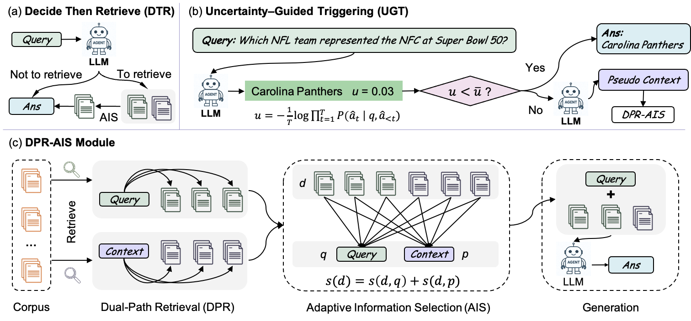

# DTR: Decide Then Retrieve

This repository provides the official implementation of **DTR**, a training-free retrieval-augmented generation (RAG) framework that dynamically decides **when to retrieve external documents** based on model uncertainty and **how to retrieve more relevant documents** based on dual-path retrieval with adaptive information selection (**DPR-AIS**). [paper](http://arxiv.org/abs/2601.03908)

---

## 1. Introduction

The overall framework of DTR is illustrated below.

<p align="center">
  
</p>

---

## 2. Environment

Create a clean conda environment and install dependencies:

```bash
mkdir DTR
cd DTR

conda create -n DTR python=3.10
conda activate DTR

git clone https://github.com/ChenWangHKU/DTR.git
cd DTR

pip install -r requirements.txt
````

---

## 3. Datasets

### 3.1 Download datasets

Create a data directory:

```bash
mkdir data
```

Download all datasets used in this paper and place them under `data/` through [BaiduDrive](https://pan.baidu.com/s/1LGoEA-fR-L5NZAcq8uhCrA)(Password: 95rn) or [OneDrive](https://connecthkuhk-my.sharepoint.com/:f:/g/personal/wchen22_connect_hku_hk/IgB_j-0yHQ-QRovT3wXmXFylAT4YNllR8xWyH4zej2SPrKE?e=ILDr7j)

Ensure that the directory structure matches the expected format used by the data loader.

---

### 3.2 Process data (offline embedding and indexing)

All document corpora are embedded **offline in parallel** and saved to disk for efficient retrieval.

**HotpotQA corpus (BGE embeddings):**

```bash
python -m retriever.ingestion --data_name hotpotqa --emb_type bge
```

**21MWiki corpus (BGE embeddings):**

```bash
python -m retriever.ingestion --data_name 21MWiki --emb_type bge
```

You may also use **E5** embeddings as the retriever:

```bash
python -m retriever.ingestion --data_name hotpotqa --emb_type e5
```

> If you encounter a data path error, revise the dataset paths in `dataset/load_data.py`.

---

## 4. Run DTR

```bash
python main.py \
  --model_name_or_path Qwen/Qwen2.5-7B-Instruct \
  --data_name hotpotqa \
  --uncertainty_threshold 0.001 \
  --RAG_type adaptive
  --topk 3 \
  --result_root results \
  --batch_size 16 \
  --index_GPUID 2 \
  --gpu_size 2 \
  --use_vLLM True \
  --retriever bge
```

> The generated outputs will be saved under `--result_root`.
> We use vLLM to accelrate inference.
> `--uncertainty_threshold 0.` means all queries require retrievals
> `--RAG_type adaptive` means using the proposed DPR-AIS mechanism (you may use `standard` to adopt the traditional RAG mechanism)

---

## 5. Evaluate Results

Use the evaluation module to compute QA performance metrics.

```bash
python -m evaluation.qa_eval \
  --eval_file results/results_hotpotqa_num7404_top3_Qwen2.5-7B-Instruct.json \
  --result_root results \
```

---

## Citation

If you find this work useful, please cite:

```bibtex
@article{chen2026decide,
  title   = {Decide Then Retrieve: A Training-Free Framework with Uncertainty-Guided Triggering and Dual-Path Retrieval},
  author  = {Chen, Wang and Qi, Guanqiang and Li, Weikang and Li, Yang and Xia, Deguo and Huang, Jizhou},
  journal = {arXiv preprint arXiv:2601.03908},
  year    = {2026},
  url     = {http://arxiv.org/abs/2601.03908}
}
